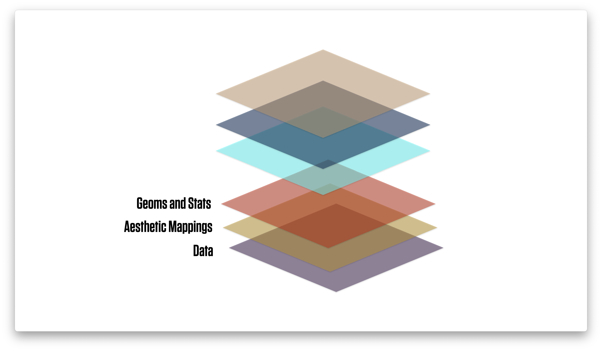
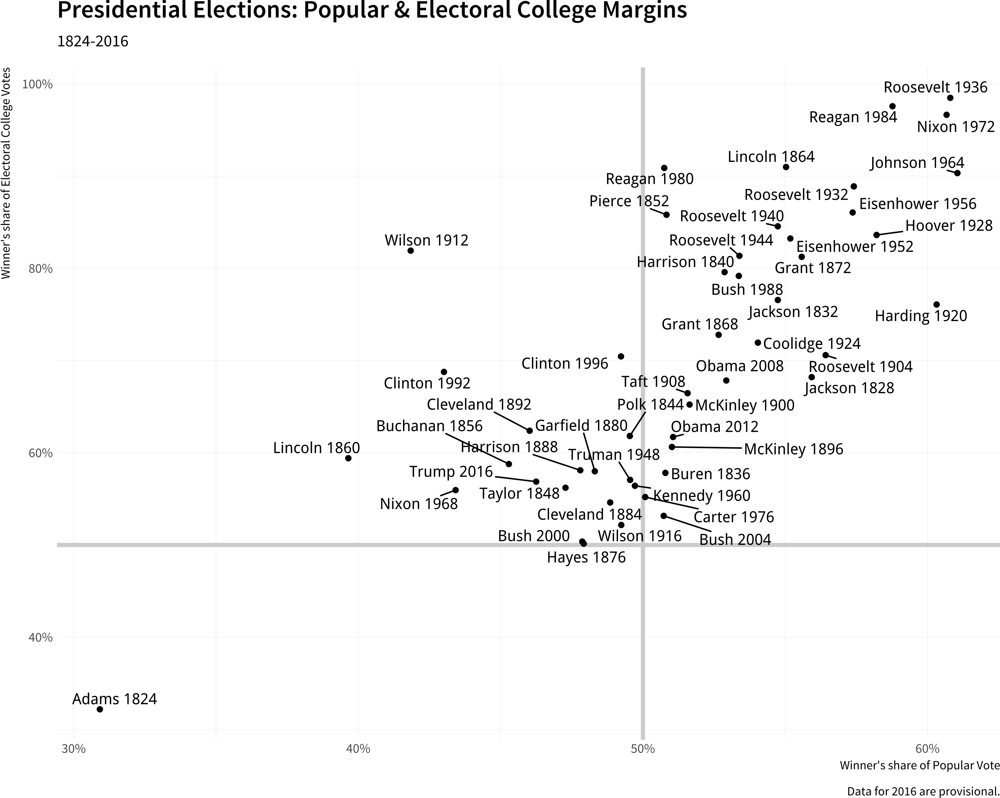

```{r packages, include=FALSE}
library(flipbookr)
library(here)
library(tidyverse)
library(kjhslides)
```


```{r setup, include=FALSE}
## Configure the slides
kjh_register_tenso()    # Default fonts. Comment out if you don't have Tenso and Berkeley fonts.
kjh_set_knitr_opts()    
kjh_set_slide_theme()   # ggplot theme to go with slides. Set tenso = FALSE if necessary.
kjh_set_xaringan_opts()


# Safe
```


class: center middle main-title section-title-1

# ggplot's .kjh-lblue[flow] of .kjh-yellow[action]

.class-info[

**Data Visualization: Session 2**

.light[Kieran Healy<br>
Duke University, May 2023
]

]


---

layout: true
class: title title-1

---

# Load our libraries

.SMALL[
```{r 05-work-with-dplyr-and-geoms-1, message = TRUE}
library(here)      # manage file paths
library(socviz)    # data and some useful functions
library(tidyverse) # your friend and mine
library(gapminder) # gapminder data
```
]


---

class: center middle main-title section-title-1

# .huge.kjh-lblue[A Plot's .kjh-yellow[Components]]

---

layout: true
class: title title-1

---

# What we need our code to make

.pull-left[

.center[]

]

--


- .medium[Data .kjh-pink[**represented**] by visual elements;]

--

- .medium[like .kjh-orange[_position_], .kjh-orange[_length_], .kjh-orange[_color_], and .kjh-orange[_size_];]

--

- .medium[Each measured on some .kjh-pink[**scale**];]

--

- .medium[Each scale with a labeled .kjh-pink[**guide**];]

--

- .medium[With the plot itself also .kjh-pink[**titled**] and labeled.]

---

layout: true
class: title title-1

---

class: center middle main-title section-title-1

# .huge[.kjh-yellow[How `ggplot`]<br />.kjh-lblue[does this]]

---

# .kjh-lblue[`ggplot`]'s flow of action

## .kjh-large.center[Here's the whole thing from start to finish]

.center[]

## .kjh-large.center[We'll go through it step by step]

---

# .kjh-lblue[`ggplot`]'s flow of action

.center[]


---

# .kjh-lblue[`ggplot`]'s flow of action

.center[]

---


# .kjh-lblue[`ggplot`]'s flow of action

.center[]

---

# .kjh-lblue[`ggplot`]'s flow of action

.center[]


---

# .kjh-lblue[`ggplot`]'s flow of action: .kjh-red[required]

.center[]


---

# .kjh-lblue[`ggplot`]'s flow of action: .kjh-red[required]

.center[]


---

# .kjh-lblue[`ggplot`]'s flow of action: .kjh-red[required]

.center[]

---

class: right bottom main-title section-title-1

## .huge.right.bottom.squish4.kjh-yellow[Let's go piece by piece]


---

# Start with the data

```{r 03-make-a-graph-12 }
gapminder
```

```{r 03-make-a-graph-13 }
dim(gapminder)
```

---

# Create a plot object

## Data is the .kjh-orange[`gapminder`] tibble.


```{r 03-make-a-graph-14 }
p <- ggplot(data = gapminder)
```

## Map variables to aesthetics

## Tell .kjh-lblue[`ggplot`] the variables you want represented by visual elements on the plot

```{r 03-make-a-graph-15 }
p <- ggplot(data = gapminder,
            mapping = aes(x = gdpPercap,
                          y = lifeExp))
```

---

# Map variables to aesthetics

## The .kjh-orange[`mapping`] `=` .kjh-green[`aes(...)`] call links variables to things you will see on the plot.

## `x` and `y` represent the quantities determining position on the x and y axes.

## Other aesthetic mappings can include, e.g., `color`, `shape`, `size`, and `fill`. 

---
layout: false
class: main-title main-title-inv

## .middle.large.squish4[.kjh-orange[Mappings] do not _directly_ specify the particular, e.g., colors, shapes, or line styles that will appear on the plot. Rather, they establish .kjh-orange[_which variables_] in the data will be represented by .kjh-orange[_which visible elements_] on the plot.]

---

layout: true
class: title title-1

---

# .kjh-orange[`p`] has data and mappings but no geom

```{r 03-make-a-graph-16, fig.cap='This empty plot has no geoms.', fig.width=8, fig.height=5}
p
```

---

# Add a geom

```{r 03-make-a-graph-17, fig.cap='A scatterplot of Life Expectancy vs GDP', fig.width=8, fig.height=5}
p + geom_point() 
```

---

# Try a different geom

```{r 03-make-a-graph-18, fig.cap='A scatterplot of Life Expectancy vs GDP', fig.width=8, fig.height=5}
p + geom_smooth() 
```

---

# Build your plots layer by layer

```{r 03-make-a-graph-19, fig.cap='Life Expectancy vs GDP, using a smoother.', fig.width=8, fig.height=5}

p <- ggplot(data = gapminder,
            mapping = aes(x = gdpPercap,
                          y=lifeExp))
p + geom_smooth()

```


---

# This process is additive

```{r 03-make-a-graph-20, fig.cap='Life Expectancy vs GDP, using a smoother.', fig.width=8, fig.height=5}

p <- ggplot(data = gapminder,
            mapping = aes(x = gdpPercap,
                          y=lifeExp))
p + geom_point() + geom_smooth()

```

---
`r chunk_reveal("reveal-additive1", widths = c(35,65), title = "# This process is additive")`

```{r reveal-additive1, include = FALSE}
p <- ggplot(data = gapminder,
            mapping = aes(x = gdpPercap,
                          y=lifeExp))
p + geom_smooth() + 
  geom_point() 
```
---

# Every .kjh-green[`geom`] is a .kjh-green[function] 

## Functions take .kjh-orange[arguments]

.pull-left.w45[
```{r codefig-functionargs, message=FALSE, fig.show="hide", fig.cap="An ill-advised linear fit", fig.width=4.8, fig.height=4.5}
p <- ggplot(data = gapminder,
            mapping = aes(x = gdpPercap,
                          y = lifeExp))
p + geom_point() + 
  geom_smooth(method = "lm") 
```
]

--

.pull-right.w55[
```{r 03-make-a-graph-21, echo=FALSE}
  knitr::include_graphics(
  knitr::fig_chunk("codefig-functionargs", "png"))
```
]

---
`r chunk_reveal("reveal-logtrans", widths = c(40,60), title = "# Keep Layering")`

```{r reveal-logtrans, include = FALSE}
 p <- ggplot(data = gapminder, 
             mapping = aes(x = gdpPercap, 
                           y=lifeExp))
p + geom_point() +
    geom_smooth(method = "lm") +
    scale_x_log10()
```
---

`r chunk_reveal("reveal-logtrans2", widths = c(50,50), title = "# Fix the labels")`

```{r reveal-logtrans2, include = FALSE}
p <- ggplot(data = gapminder, 
            mapping = aes(x = gdpPercap, 
                          y=lifeExp))
p + geom_point() +
    geom_smooth(method = "lm") +
    scale_x_log10(labels = scales::label_dollar())
```

---

# Add labels, title, and caption

.pull-left.w45[
```{r codefig-logtranslab, message=FALSE, fig.show="hide", fig.width=5, fig.height=4.5}
p <- ggplot(data = gapminder, 
            mapping = aes(x = gdpPercap, 
                          y = lifeExp))
p + geom_point() + 
  geom_smooth(method = "lm") +
    scale_x_log10(labels = scales::label_dollar()) +
    labs(x = "GDP Per Capita", 
         y = "Life Expectancy in Years",
         title = "Economic Growth and Life Expectancy",
         subtitle = "Data points are country-years",
         caption = "Source: Gapminder.")
```
]

--

.pull-right.w55[
```{r 03-make-a-graph-22, echo=FALSE}
  knitr::include_graphics(
  knitr::fig_chunk("codefig-logtranslab", "png"))
```
]

---

class: right bottom main-title section-title-1

## .huge.right.bottom.squish4[.kjh-yellow[Mapping] vs .kjh-lblue[Setting]<br />your plot's aesthetics]

---

# "Can I change the color of the points?"


```{r 03-make-a-graph-23 }
p <- ggplot(data = gapminder,
            mapping = aes(x = gdpPercap,
                          y = lifeExp,
                          color = "purple"))

## Put in an object for convenience
p_out <- p + geom_point() +
    geom_smooth(method = "loess") +
    scale_x_log10()
```

---

# What has gone wrong here?

```{r 03-make-a-graph-24, fig.width=8, fig.height=5}
p_out
```


---

# Try again

```{r 03-make-a-graph-25 }
p <- ggplot(data = gapminder,
            mapping = aes(x = gdpPercap,
                          y = lifeExp))

## Put in an object for convenience
p_out <- p + geom_point(color = "purple") +
    geom_smooth(method = "loess") +
    scale_x_log10()
```


---

# Try again

```{r 03-make-a-graph-26, fig.width=8, fig.height=5}
p_out
```

---

# Geoms can take many arguments

- Here we .kjh-orange[set] `color`, `size`, and `alpha`. Meanwhile `x` and `y` are .kjh-lblue[mapped].

- We also give non-default values to some other arguments

```{r 03-make-a-graph-27 }
p <- ggplot(data = gapminder,
            mapping = aes(x = gdpPercap,
                          y = lifeExp)) 
p_out <- p + geom_point(alpha = 0.3) +
    geom_smooth(color = "orange", 
                se = FALSE, 
                linewidth = 8, 
                method = "lm") +
    scale_x_log10()
```

---

# Geoms can take many arguments

```{r 03-make-a-graph-28, fig.width=8.5, fig.height=5}
p_out
```

---

# Setting .kjh-orange[`alpha`] is handy for overplotted data 

.pull-left.w45[
```{r codefig-alphapoints, message=FALSE, fig.show="hide", fig.width=5, fig.height=4.5}
p <- ggplot(data = gapminder, 
            mapping = aes(x = gdpPercap, 
                          y = lifeExp))
p + geom_point(alpha = 0.3) + #<<
  geom_smooth(method = "lm") +
    scale_x_log10(labels = scales::label_dollar()) +
    labs(x = "GDP Per Capita", 
         y = "Life Expectancy in Years",
         title = "Economic Growth and Life Expectancy",
         subtitle = "Data points are country-years",
         caption = "Source: Gapminder.")
```
]

--

.pull-right.w55[
```{r 03-make-a-graph-extra, echo=FALSE}
  knitr::include_graphics(
  knitr::fig_chunk("codefig-alphapoints", "png"))
```
]

---

class: right bottom main-title section-title-1

## .huge.right.bottom.squish4.kjh-yellow[Map or Set values<br />.kjh-lblue[per geom]]

---
`r chunk_reveal("reveal-pergeom1", widths = c(45,55), title = "# Geoms can take their own mappings")`

```{r reveal-pergeom1, include = FALSE}
p <- ggplot(data = gapminder,
            mapping = aes(x = gdpPercap,
                          y = lifeExp,
                          color = continent,
                          fill = continent))
p + geom_point() +
    geom_smooth(method = "loess") +
    scale_x_log10(labels = scales::label_dollar())
```

---
`r chunk_reveal("reveal-pergeom2", widths = c(45,55), title = "# Geoms can take their own mappings")`

```{r reveal-pergeom2, include = FALSE}
p <- ggplot(data = gapminder,
            mapping = aes(x = gdpPercap,
                          y = lifeExp))
p + geom_point(mapping = aes(color = continent)) +
    geom_smooth(method = "loess") +
    scale_x_log10(labels = scales::label_dollar())
 
```

---
layout: false
class: main-title main-title-inv middle

# .middle.squish4.large.kjh-orange[Pay attention to which scales and guides are drawn, and why]

---

layout: true
class: title title-1

---

# Guides and scales reflect .kjh-green[`aes()`] mappings

.pull-left[

- `mapping = aes(color = continent, fill = continent)`

.right[]

]

--

.pull-right[


- `mapping = aes(color = continent)`

.left[]

]

---
layout: false
class: main-title main-title-inv

# .middle.squish4.large[.kjh-blue[Remember:] .kjh-blue[Every mapped variable has a scale]]


---
layout: false
class: main-title main-title-inv center middle 


.center[]

---

class: main-title main-title-inv center middle 

.center[]


---

class: main-title main-title-inv center middle 

.center[]


---

class: main-title main-title-inv center middle 

.center[]


---

layout: true
class: title title-1

---

class: center middle main-title section-title-1

# .huge[.kjh-yellow[Feeding data]<br /> .kjh-lblue[to `ggplot`]]

---

layout: false
class: center middle

## .middle.huge.squish4[.kjh-orange[Transform and summarize first.]<br />.kjh-lblue[Then send your clean tables to ggplot.]]

---

layout: true
class: title title-1

---

# Summarizing a Table

- Here's what we're going to do:

.center[]

---

# Summarizing a Table

- We're just taking a look at the relevant columns here. We don't need to narrow it like this to do our summary, though.


```{r 05-work-with-dplyr-and-geoms-7 }
gss_sm |> 
  select(id, bigregion, religion) 
```


---

`r chunk_reveal("reveal-onetablevar", widths = c(35,65), title = "# Count up by .kjh-orange[_one_] column or variable")`

```{r reveal-onetablevar, include = FALSE}
gss_sm |> 
  group_by(bigregion) |>  #<<
  summarize(total = n()) 
```

Grouping changes the _logical_ structure of the tibble. It tells you what subsets of rows the next mutate or summary operation will be carried out within. 

---
`r chunk_reveal("reveal-pipe1", widths = c(35,65), title = "# Summarize by region and religion")`

```{r reveal-pipe1, include = FALSE}
gss_sm |>  
  group_by(bigregion, religion) |> 
  summarize(total = n()) |> 
  mutate(freq = total / sum(total),
           pct = round((freq*100), 1))

```
---

# Pipelines carry assumptions forward

.small[
```{r 05-work-with-dplyr-and-geoms-9 }
gss_sm |> 
  group_by(bigregion, religion) |> #<<
  summarize(total = n()) |> 
  mutate(freq = total / sum(total),
           pct = round((freq*100), 1))
```
]

Groups are carried forward till summarized over, or explicitly ungrouped with .kjh-green[`ungroup()`]. 

--

Summary calculations are done on the innermost group, which then "disappears". (Notice how .kjh-orange[`religion`] is no longer a group in the output, but .kjh-orange[`bigregion`] is.)

---

# Pipelines carry assumptions forward

.small[
```{r 05-work-with-dplyr-and-geoms-10 }
gss_sm |> 
  group_by(bigregion, religion) |> 
  summarize(total = n()) |> 
  mutate(freq = total / sum(total),
         pct = round((freq*100), 1)) #<<
```
]

.kjh-green[**`mutate()`**] is quite clever. See how we can immediately use .kjh-orange[**`freq`**] to calculate .kjh-orange[**`pct`**], even though we are creating them both in the same .kjh-green[**`mutate()`**] expression.

---

# Convenience functions

.small[

```{r 05-work-with-dplyr-and-geoms-11 }
gss_sm |> 
  group_by(bigregion, religion) |> #<<
  summarize(total = n()) |> #<<
  mutate(freq = total / sum(total),
           pct = round((freq*100), 1)) 
```
]

We're going to be doing this .kjh-green[**`group_by()`**] ... .kjh-green[**`n()`**] step a lot. Some shorthand for it would be useful.

---

# .kjh-pink[Three options] for counting up rows

.pull-left-3[

- .SMALL.squish3[Do it yourself with .kjh-green[**`n()`**]]

.SMALL[
```{r 05-work-with-dplyr-and-geoms-12 }
gss_sm |> 
  group_by(bigregion, religion) |> #<<
  summarize(n = n()) #<<
```
]

- .small.squish3[_The result is **grouped**._]
]

--

.pull-middle-3[

- .SMALL.squish3[Use .kjh-green[**`tally()`**]]

.SMALL[
```{r 05-work-with-dplyr-and-geoms-13 }
gss_sm |> 
  group_by(bigregion, religion) |> 
  tally() #<<
```
]

- .small.squish3[_The result is **grouped**._]
]

--

.pull-right-3[

- .SMALL.squish3[use .kjh-green[**`count()`**]]

.SMALL[
```{r 05-work-with-dplyr-and-geoms-14 }
gss_sm |> 
  count(bigregion, religion) #<<
```
]

- .small.squish3[_One step; the result is **not grouped**._]
]

---


# Pipelined tables can be quickly checked

.pull-left[

```{r 05-work-with-dplyr-and-geoms-15 }
## Calculate pct religion within region?
rel_by_region <- gss_sm |> 
  count(bigregion, religion) |> 
  mutate(pct = round((n/sum(n))*100, 1)) 

rel_by_region
```

Hm, did I sum over right group?

]

--
.pull-right[

```{r 05-work-with-dplyr-and-geoms-16 }
## Each region should sum to ~100
rel_by_region |> 
  group_by(bigregion) |> 
  summarize(total = sum(pct)) 

```

No! What has gone wrong here?

]

---

# Pipelined tables can be quickly checked

.pull-left[

```{r 05-work-with-dplyr-and-geoms-17 }
rel_by_region <- gss_sm |> 
  count(bigregion, religion) |> #<< 
  mutate(pct = round((n/sum(n))*100, 1)) 
```

.SMALL.squish3[.kjh-green[**`count()`**] returns ungrouped results, so there are no groups carry forward to the .kjh-green[**`mutate()`**] step.]

```{r 05-work-with-dplyr-and-geoms-18 }
rel_by_region |> 
  summarize(total = sum(pct))
```

.SMALL.squish3[With .kjh-green[**`count()`**], the .kjh-orange[**`pct`**] values in this case are the marginals for the whole table.]

]

--
.pull-right[

```{r 05-work-with-dplyr-and-geoms-19 }
rel_by_region <- gss_sm |> 
  group_by(bigregion, religion) |> #<<
  tally() |> #<<
  mutate(pct = round((n/sum(n))*100, 1)) 
```

```{r 05-work-with-dplyr-and-geoms-20 }
# Check
rel_by_region |> 
  group_by(bigregion) |> 
  summarize(total = sum(pct))

```

.SMALL.squish3[.kjh-green[**`group_by()`**] and .kjh-green[**`tally()`**] both return a grouped result. We get some rounding error because we used .kjh-green[**`round()`**] after summing originally.]
]


---

# Two lessons

## Check your tables!

-     Pipelines feed their content forward, so you need to make sure your results are not incorrect.

--

- Often, complex tables and graphs can be disturbingly plausible even when wrong.

--

- So, figure out what the result should be and test it!

--

- Starting with simple or toy cases can help with this process.

---

# Two lessons

## Inspect your pipes!

- Understand pipelines by running them forward or peeling them back a step at a time.

- This is a _very_ effective way to understand your own and other people's code.

---

# Pass your pipeline on to a .kjh-yellow[table]

```{r 05-work-with-dplyr-and-geoms-21, eval = FALSE}
gss_sm |> 
  count(bigregion, religion) |> 
  pivot_wider(names_from = bigregion, values_from = n) |>  #<<
  kable()  
```


.small[
```{r 05-work-with-dplyr-and-geoms-22, echo = FALSE}
gss_sm |> 
  count(bigregion, religion) |> 
  pivot_wider(names_from = bigregion, values_from = n) |> 
  knitr::kable()  
```
]


---

# Pass your pipeline on to a .kjh-yellow[graph]

.SMALL[
```{r 05-work-with-dplyr-and-geoms-23, fig.height=4, fig.width=15}
gss_sm |> 
  group_by(bigregion, religion) |> 
  tally() |> 
  mutate(pct = round((n/sum(n))*100, 1)) |> 
  drop_na() |> 
  ggplot(mapping = aes(x = pct, y = reorder(religion, -pct), fill = religion)) + #<<
  geom_col() + #<<
    labs(x = "Percent", y = NULL) +
    guides(fill = "none") + 
    facet_wrap(~ bigregion, nrow = 1)
```
]

---

layout: false
class: center middle

## .middle.huge.squish4[.kjh-orange[Use `dplyr` pipelines to create summary tables.]<br />.kjh-lblue[Then send your clean tables to `ggplot`.]]

---

class: right bottom main-title section-title-1

## .huge.right.bottom.squish4[.kjh-lblue[Facets] .kjh-yellow[are often<br />better than] .kjh-lblue[Guides]]


---

layout: true
class: title title-1

---

# Let's put that table in an object


```{r 05-work-with-dplyr-and-geoms-24 }
rel_by_region <- gss_sm |> 
  group_by(bigregion, religion) |> 
  tally() |> 
  mutate(pct = round((n/sum(n))*100, 1)) |> 
  drop_na()


head(rel_by_region)
```

---

# We might write ...

```{r 05-work-with-dplyr-and-geoms-25 }
p <- ggplot(data = rel_by_region, 
                mapping = aes(x = bigregion, 
                              y = pct, 
                              fill = religion))
p_out <- p + geom_col(position = "dodge") +
    labs(x = "Region",
         y = "Percent", 
         fill = "Religion") 
```

---

# We might write ...

```{r 05-work-with-dplyr-and-geoms-26, echo = FALSE, fig.height=7, fig.width=12}
p_out
```


---

# Is this an effective graph? .kjh-red[Not really!]

```{r 05-work-with-dplyr-and-geoms-27, echo = FALSE, fig.height=7, fig.width=12}
p_out
```

---

# Try .kjh-lblue[faceting] instead

```{r 05-work-with-dplyr-and-geoms-28 }
p <- ggplot(data = rel_by_region, 
                mapping = aes(x = pct, #<<
                              y = reorder(religion, -pct), #<<
                              fill = religion))
p_out_facet <- p + geom_col() +
  guides(fill = "none") + 
  facet_wrap(~ bigregion, nrow = 1) +
  labs(x = "Percent",
       y = NULL) 

```

- Putting categories on the y-axis is a very useful trick.

- Faceting reduces the number of guides the viewer needs to consult. 

---


# Try .kjh-lblue[faceting] instead

```{r 05-work-with-dplyr-and-geoms-29, echo = FALSE, fig.height = 3.5, fig.width=15}
p_out_facet
```

### .kjh-green[Try putting categories on the y-axis. (And reorder them by x.)]

### .kjh-lblue[Try faceting variables instead of mapping them to color or shape.]

### .kjh-pink[Try to minimize the need for guides and legends.]


---

class: right bottom main-title section-title-1

## .huge.right.bottom.squish4[.kjh-yellow[Some data on]<br />.kjh-lblue[Organ Donation]]

---
# .kjh-pink[`organdata`] is in the .kjh-lblue[`socviz`] package

```{r 05-work-with-dplyr-and-geoms-37 }
organdata
```

---

# First looks

```{r 05-work-with-dplyr-and-geoms-38, fig.width=10, fig.height=6}
p <- ggplot(data = organdata,
            mapping = aes(x = year, y = donors))
p + geom_point()
```

---

# First looks

```{r 05-work-with-dplyr-and-geoms-39, fig.width=10, fig.height=6}
p <- ggplot(data = organdata,
            mapping = aes(x = year, y = donors))
p + geom_line() 
```

---

# First looks

```{r 05-work-with-dplyr-and-geoms-40, fig.width=10, fig.height=6}
p <- ggplot(data = organdata,
            mapping = aes(x = year, y = donors))
p + geom_line(aes(group = country)) 
```


---

# First looks

```{r 05-work-with-dplyr-and-geoms-41a, fig.width=21, fig.height=8}
p <- ggplot(data = organdata,
            mapping = aes(x = year, y = donors))
p + geom_line() + 
  facet_wrap(~ country, nrow = 3)
```

---

# First looks

```{r 05-work-with-dplyr-and-geoms-41b, fig.width=21, fig.height=8}
p <- ggplot(data = organdata,
            mapping = aes(x = year, y = donors))
p + geom_line() + 
  facet_wrap(~ reorder(country, donors, na.rm = TRUE), nrow = 3)
```

---

# First looks

```{r 05-work-with-dplyr-and-geoms-41c, fig.width=21, fig.height=8}
p <- ggplot(data = organdata,
            mapping = aes(x = year, y = donors))
p + geom_line() + 
  facet_wrap(~ reorder(country, -donors, na.rm = TRUE), nrow = 3)
```


---


class: right bottom main-title section-title-1

## .huge.right.bottom.squish4[.kjh-yellow[Showing continuous measures] .kjh-lblue[by category]]

---

# Boxplots: .kjh-green[`geom_boxplot()`]

```{r 05-work-with-dplyr-and-geoms-42, fig.width = 15, fig.height=5}
## Pipeline the data directly; then it's implicitly the first argument to `ggplot()`
organdata |> 
  ggplot(mapping = aes(x = country, y = donors)) + 
  geom_boxplot()
```

---

# Put categories on the y-axis!

```{r 05-work-with-dplyr-and-geoms-43, fig.width=10, fig.height=6}
organdata |> 
  ggplot(mapping = aes(x = donors, y = country)) + #<<
  geom_boxplot() +
  labs(y = NULL)
```

---

# Reorder y by the mean of x

```{r 05-work-with-dplyr-and-geoms-44, fig.width=10, fig.height=6}
organdata |> 
  ggplot(mapping = aes(x = donors, y = reorder(country, donors, na.rm = TRUE))) + #<<
  geom_boxplot() +
  labs(y = NULL)
```

---

# (Reorder y by any statistic you like)

```{r 05-work-with-dplyr-and-geoms-45, fig.width=10, fig.height=6}
organdata |> 
  ggplot(mapping = aes(x = donors, y = reorder(country, donors, sd, na.rm = TRUE))) + #<<
  geom_boxplot() +
  labs(y = NULL)
```

---

# .kjh-green[geom_boxplot()] knows .kjh-orange[`color`] and .kjh-orange[`fill`]

```{r 05-work-with-dplyr-and-geoms-46, fig.width=10, fig.height=6}
organdata |> 
  ggplot(mapping = aes(x = donors, y = reorder(country, donors, na.rm = TRUE), fill = world)) + #<<
  geom_boxplot() +
  labs(y = NULL)
```


---

# These strategies are quite general

```{r 05-work-with-dplyr-and-geoms-47, fig.width=10, fig.height=5.5}
organdata |> 
  ggplot(mapping = aes(x = donors, y = reorder(country, donors, na.rm = TRUE), color = world)) + 
  geom_point(size = rel(3)) + #<<
  labs(y = NULL)
```


---

# .kjh-green[geom-jitter()] can help with overplotting

```{r 05-work-with-dplyr-and-geoms-48, fig.width=10, fig.height=6}
organdata |> 
  ggplot(mapping = aes(x = donors, y = reorder(country, donors, na.rm = TRUE), color = world)) + 
  geom_jitter(size = rel(3)) + #<<
  labs(y = NULL)
```

---

# Adjust with a .kjh-orange[`position`] argument

```{r 05-work-with-dplyr-and-geoms-49, fig.width=10, fig.height=6}
organdata |> 
  ggplot(mapping = aes(x = donors, y = reorder(country, donors, na.rm = TRUE),
                       color = world)) + 
  geom_jitter(size = rel(3), position = position_jitter(height = 0.1)) + #<<
  labs(y = NULL)
```


---

class: right bottom main-title section-title-1

## .huge.right.bottom.squish4[.kjh-yellow[Summarize better]<br /> .kjh-lblue[with **`dplyr`**]]


---

# Summarize a bunch of variables

```{r 05-work-with-dplyr-and-geoms-50 }
by_country <- organdata |>  
  group_by(consent_law, country)  |> 
    summarize(donors_mean= mean(donors, na.rm = TRUE),
              donors_sd = sd(donors, na.rm = TRUE),
              gdp_mean = mean(gdp, na.rm = TRUE),
              health_mean = mean(health, na.rm = TRUE),
              roads_mean = mean(roads, na.rm = TRUE),
              cerebvas_mean = mean(cerebvas, na.rm = TRUE))

head(by_country)
```

- .medium[This works, but there's so much repetition! It's an open invitation to make mistakes copying and pasting.]

---
layout: false
class: main-title main-title-inv

# .middle.squish4.huge[.kjh-lblue[DRY:]] <br /> .middle.squish4.large.kjh-orange[Don't Repeat Yourself]


---

layout: true
class: title title-1

---

# Use .kjh-green[`across()`] and .kjh-green[`where()`] instead

```{r 05-work-with-dplyr-and-geoms-51 }
by_country <- organdata |> 
  group_by(consent_law, country) |>
    summarize(across(where(is.numeric),#<<
                     list(mean = mean, 
                          sd = sd),
                      na.rm = TRUE))
head(by_country)              
              
```

---

# Use .kjh-green[`across()`] and .kjh-green[`where()`] instead

```{r 05-work-with-dplyr-and-geoms-52 }
by_country <- organdata |> 
  group_by(consent_law, country) |>
    summarize(across(where(is.numeric),
                     list(mean = mean, 
                          sd = sd),
                      na.rm = TRUE), 
              .groups = "drop") #<<
head(by_country)              
              
```

---

# Plot our summary data


.pull-left.w45[
```{r codefig-consent1, message=FALSE, fig.show="hide", fig.width=8, fig.height=5}
by_country |> 
  ggplot(mapping = 
           aes(x = donors_mean, 
               y = reorder(country, donors_mean),
               color = consent_law)) + 
  geom_point(size=3) +
  labs(x = "Donor Procurement Rate",
       y = NULL, 
       color = "Consent Law")
```
]

--

.pull-right.w55[
```{r 05-work-with-dplyr-and-geoms-53, echo=FALSE}
  knitr::include_graphics(
  knitr::fig_chunk("codefig-consent1", "png"))

```

]


---

# What about faceting it instead?

.pull-left.w45[

```{r codefig-consent2, message=FALSE, fig.show="hide", fig.width=8, fig.height=5}
by_country |> 
  ggplot(mapping = 
           aes(x = donors_mean, 
               y = reorder(country, donors_mean),
               color = consent_law)) + 
  geom_point(size=3) +
  guides(color = "none") +
  facet_wrap(~ consent_law) + #<<
  labs(x = "Donor Procurement Rate",
       y = NULL, 
       color = "Consent Law")
```

.pull-left.w80[The problem is that countries can only be in one Consent Law category.]

]

--

.pull-right.w55[
```{r 05-work-with-dplyr-and-geoms-54, echo=FALSE}
  knitr::include_graphics(
  knitr::fig_chunk("codefig-consent2", "png"))
```
]


---

# What about faceting it instead?

.pull-left.w45[
```{r codefig-consent2a, message=FALSE, fig.show="hide", fig.width=5, fig.height=9}
by_country |> 
  ggplot(mapping = 
           aes(x = donors_mean, 
               y = reorder(country, donors_mean),
               color = consent_law)) + 
  geom_point(size=3) +
  guides(color = "none") +
  facet_wrap(~ consent_law, ncol = 1) + #<<
  labs(x = "Donor Procurement Rate",
       y = NULL, 
       color = "Consent Law")
```

.pull-left.w80[Restricting to one column doesn't fix it.]

]


--

.pull-right.w55[
```{r 05-work-with-dplyr-and-geoms-55, echo=FALSE}
  knitr::include_graphics(
  knitr::fig_chunk("codefig-consent2a", "png"))
```
]


---

# Allow the y-scale to vary

.pull-left.w45[
```{r codefig-consent3, message=FALSE, fig.show="hide", fig.width=8, fig.height=6}
by_country |> 
  ggplot(mapping = 
           aes(x = donors_mean, 
               y = reorder(country, donors_mean),
               color = consent_law)) + 
  geom_point(size=3) +
  guides(color = "none") +
  facet_wrap(~ consent_law, 
             ncol = 1,
             scales = "free_y") +  #<<
  labs(x = "Donor Procurement Rate",
       y = NULL, 
       color = "Consent Law")
```

.pull.left.w90[Normally the point of a facet is to preserve comparability between panels by not allowing the scales to vary. But for categorical measures it can be useful to allow this.]

]


--

.pull-right.w55[
```{r 05-work-with-dplyr-and-geoms-56, echo=FALSE}
  knitr::include_graphics(
  knitr::fig_chunk("codefig-consent3", "png"))
```
]

---

# Again, these methods are general

.pull-left.w50[
```{r codefig-consent4, message=FALSE, fig.show="hide", fig.width=8, fig.height=6}
by_country |> 
  ggplot(mapping = 
           aes(x = donors_mean, 
               y = reorder(country, donors_mean),
               color = consent_law)) + 
  geom_pointrange(mapping = #<<
                    aes(xmin = donors_mean - donors_sd, #<<
                        xmax = donors_mean + donors_sd)) + #<<
  guides(color = "none") +
  facet_wrap(~ consent_law, 
             ncol = 1,
             scales = "free_y") +  
  labs(x = "Donor Procurement Rate",
       y = NULL, 
       color = "Consent Law")
```
]

--

.pull-right.w50[
```{r 05-work-with-dplyr-and-geoms-57, echo=FALSE}
  knitr::include_graphics(
  knitr::fig_chunk("codefig-consent4", "png"))
```
]

---

class: right bottom main-title section-title-1

## .huge.right.bottom.squish4.kjh-yellow[Plot text directly]

---

# .kjh-green[`geom_text()`] for basic labels is very limited

---

# We'll use .kjh-lblue[`ggrepel`] instead

### The .kjh-lblue[`ggrepel`] package provides .kjh-green[`geom_text_repel()`] and .kjh-green[`geom_label_repel()`]

---

class: right bottom main-title section-title-1

## .huge.right.bottom.squish4.kjh-yellow[U.S. Historic<br/>Presidential Elections]

---

# .kjh-pink[`elections_historic`] is in .kjh-orange[`socviz`] 

```{r 05-work-with-dplyr-and-geoms-61 }
elections_historic
```

---

# We'll draw a plot like this

.center[]


---

# Keep things neat

```{r 05-work-with-dplyr-and-geoms-62 }
## The packages we'll use in addition to ggplot
library(ggrepel) #<<
library(scales) #<<

p_title <- "Presidential Elections: Popular & Electoral College Margins"
p_subtitle <- "1824-2016"
p_caption <- "Data for 2016 are provisional."
x_label <- "Winner's share of Popular Vote"
y_label <- "Winner's share of Electoral College Votes"
```

---

# Base Layer, Lines, Points


.pull-left.w45[
```{r codefig-presplot1, message=FALSE, fig.show="hide", fig.width=5, fig.height=4.5}
p <- ggplot(data = elections_historic, 
            mapping = aes(x = popular_pct, 
                          y = ec_pct,
                          label = winner_label))

p + geom_hline(yintercept = 0.5, 
               linewidth = 1.4, 
               color = "gray80") +
    geom_vline(xintercept = 0.5, 
               linewidth = 1.4, 
               color = "gray80") +
    geom_point()

```
]

--

.pull-right.w55[
```{r 05-work-with-dplyr-and-geoms-63, echo=FALSE}
  knitr::include_graphics(
  knitr::fig_chunk("codefig-presplot1", "png"))
```
]

---

# Add the labels


.pull-left.w45[
```{r codefig-presplot2, message=FALSE, fig.show="hide", fig.width=5, fig.height=4.5}
p <- ggplot(data = elections_historic, 
            mapping = aes(x = popular_pct, 
                          y = ec_pct,
                          label = winner_label))

p + geom_hline(yintercept = 0.5, 
               linewidth = 1.4, color = "gray80") +
  geom_vline(xintercept = 0.5, 
             linewidth = 1.4, color = "gray80") +
  geom_point() + 
  geom_text_repel()

```

.pull-left.w85[This looks messy because .kjh-green[`geom_text_repel()`] uses the dimensions of the available graphics device to iteratively figure out the labels. Let's allow it to draw on the whole slide.]

]

--

.pull-right.w55[
```{r 05-work-with-dplyr-and-geoms-64, echo=FALSE}
  knitr::include_graphics(
  knitr::fig_chunk("codefig-presplot2", "png"))
```
]

---

# The labeling is with respect to the plot size

```{r 05-work-with-dplyr-and-geoms-65 }
p <- ggplot(data = elections_historic, 
            mapping  = aes(x = popular_pct, 
                           y = ec_pct,
                           label = winner_label))

p_out <- p + 
  geom_hline(yintercept = 0.5, 
             linewidth = 1.4, 
             color = "gray80") +
  geom_vline(xintercept = 0.5, 
             linewidth = 1.4, 
             color = "gray80") +
  geom_point() + 
  geom_text_repel() #<<

```

---

layout:false
class: middle center

```{r 05-work-with-dplyr-and-geoms-66, echo = FALSE, fig.width=15, fig.height=8.5}
p_out
```

---

layout: true
class: title title-1

---

# Adjust the Scales

```{r 05-work-with-dplyr-and-geoms-67 }
p <- ggplot(data = elections_historic, 
            mapping  = aes(x = popular_pct, 
                           y = ec_pct,
                           label = winner_label))
p_out <- p + geom_hline(yintercept = 0.5, 
                        linewidth = 1.4, 
                        color = "gray80") +
    geom_vline(xintercept = 0.5, 
               linewidth = 1.4, 
               color = "gray80") +
    geom_point() +
    geom_text_repel() +
    scale_x_continuous(labels = label_percent()) + #<<
    scale_y_continuous(labels = label_percent()) #<<
```

---

layout:false
class: middle center

```{r 05-work-with-dplyr-and-geoms-68, echo = FALSE, fig.width=15, fig.height=8.5}
p_out
```

---

layout: true
class: title title-1

---

# Add the labels

```{r 05-work-with-dplyr-and-geoms-69 }
p <- ggplot(data = elections_historic, 
            mapping  = aes(x = popular_pct, 
                           y = ec_pct,
                           label = winner_label))
p_out <- p + geom_hline(yintercept = 0.5, 
                        linewidth = 1.4, 
                        color = "gray80") +
  geom_vline(xintercept = 0.5, 
             linewidth = 1.4, 
             color = "gray80") +
  geom_point() +
  geom_text_repel(mapping = aes(family = "Tenso Slide")) +#<<
  scale_x_continuous(labels = label_percent()) +
  scale_y_continuous(labels = label_percent()) +
  labs(x = x_label, y = y_label,  #<<
       title = p_title, 
       subtitle = p_subtitle,
       caption = p_caption)   
  
  
  
```


---

layout:false
class: middle center

```{r 05-work-with-dplyr-and-geoms-70, echo = FALSE, fig.width=15, fig.height=8.5}
p_out
```


```{r 05-work-with-dplyr-and-geoms-83, echo=FALSE}
kjhslides::kjh_set_slide_theme()
```

