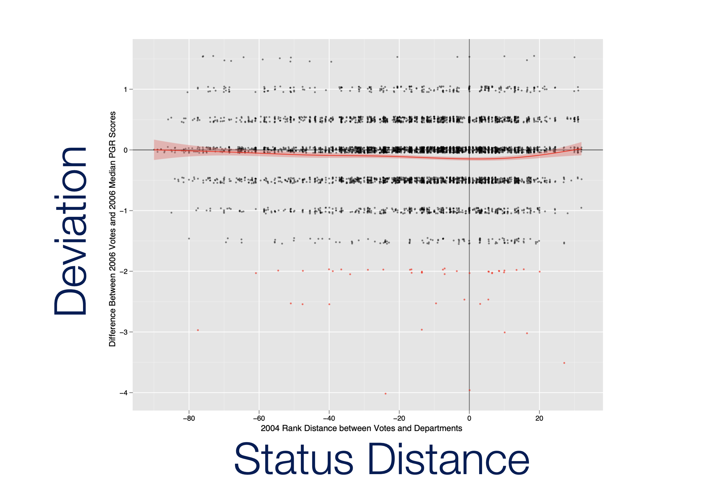
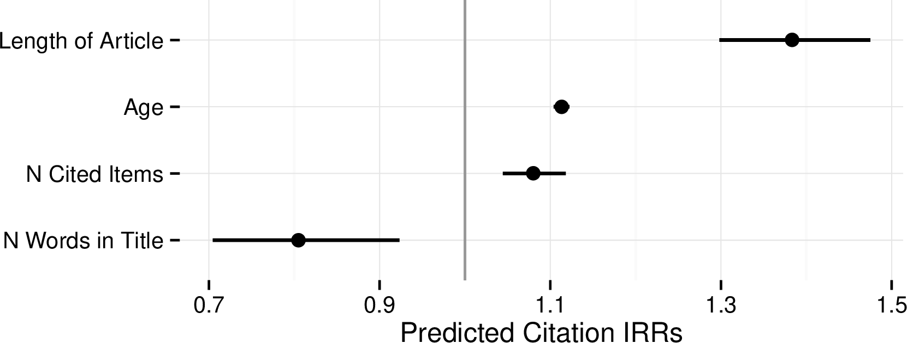
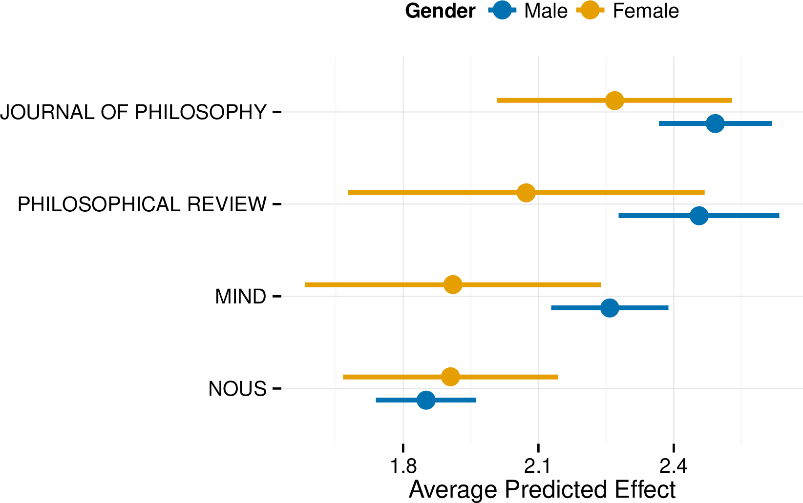
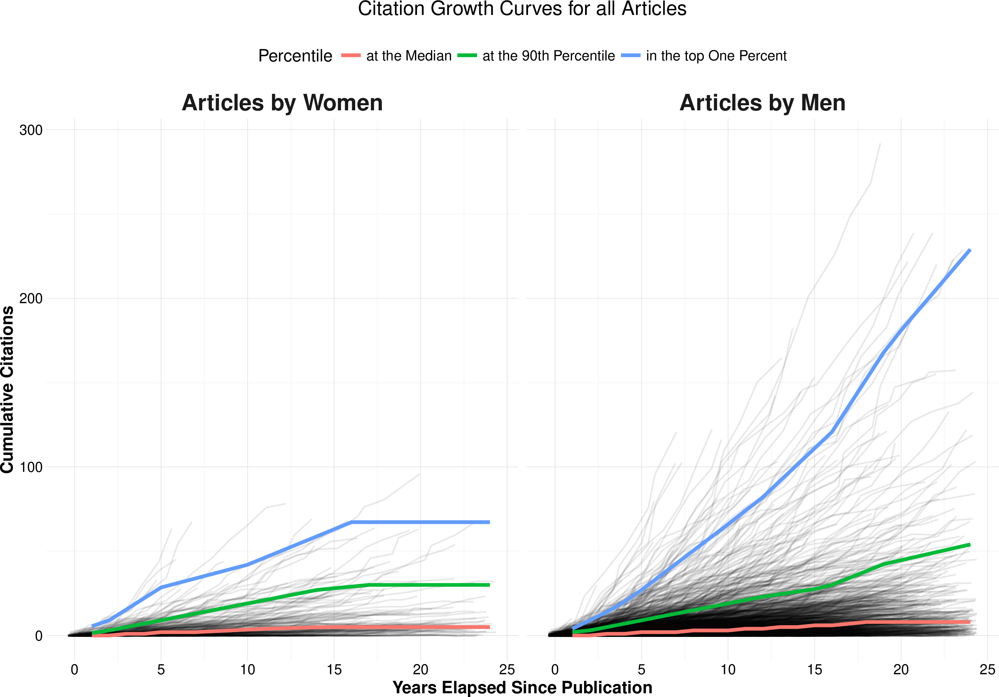

```{r note, include=FALSE}
## NB: By default the  template will create a new subdirectory with its files inside.
```


```{r packages, include=FALSE}
library(flipbookr)
library(here)
library(tidyverse)
library(kjhslides)
```


```{r setup, include=FALSE}
## Configure the slides

kjh_register_tenso()    # Default fonts. Comment out if you don't have Tenso and Berkeley fonts.
kjh_set_knitr_opts()    
kjh_set_slide_theme()   # ggplot theme to go with slides. Set tenso = FALSE if necessary.
kjh_set_xaringan_opts()

```


class: center middle main-title section-title-1

# .kjh-yellow[Polishing your plots]<br /> .kjh-lblue[and Presenting them]

.class-info[

**Data Visualization: Session 3**

.light[Kieran Healy<br>
Duke University, May 2023
]

]


---

layout: true
class: title title-1

---

# Load our libraries

```{r 08-polishing-and-presenting-plots-1, message = FALSE}
library(here)       # manage file paths
library(tidyverse)  # your friend and mine
library(socviz)     # data and some useful functions
library(ggrepel)    # Text and labels
library(colorspace) # luminance-balanced palettes
library(scales)      # scale adjustments and enhancements
library(ggforce)    # useful enhancements to ggplot
```


---

class: center middle main-title section-title-1

# .huge[.kjh-yellow[Piece by piece,]<br/>.kjh-lblue[Layer by layer]]

---

# Build your plots a piece at a time

```{r 08-polishing-and-presenting-plots-2 }
asasec <- as_tibble(asasec)
asasec
```

---

# Build your plots a piece at a time

```{r 08-polishing-and-presenting-plots-3, echo = FALSE, fig.height=6, fig.width=10}
asasec |> 
  filter(Year == 2014) |> 
  ggplot(mapping = aes(x = Members, 
                       y = Revenues, 
                       label = Sname)) + 
  geom_smooth() + 
  geom_point()

```

---

# Build your plots a piece at a time

```{r 08-polishing-and-presenting-plots-4, echo = FALSE, fig.height=6, fig.width=10}
asasec |> 
  filter(Year == 2014) |> 
  ggplot(mapping = aes(x = Members, 
                       y = Revenues, 
                       label = Sname)) + 
  geom_smooth(method = "lm", 
              se = FALSE, 
              color = "gray60") +
  geom_point(mapping = aes(color = Journal), 
             size = rel(3)) + 
  geom_text_repel(data=subset(asasec,
                    Year == 2014 & 
                    Revenues > 7000),
                    size = rel(5), 
                    mapping = 
                    aes(family = "Tenso Slide")) + 
  scale_y_continuous(labels = 
                       scales::label_dollar()) + 
  labs(x="Membership", y="Revenues",
        color = "Section has own Journal",
        title = "ASA Sections",
        subtitle = "2014 Calendar year.",
        caption = "Source: ASA annual report.") + 
  theme(legend.position = "bottom")
  

```


---
`r chunk_reveal("reveal-asasteps", widths = c(40,60), title = "# Build your plots a piece at a time")`

```{r reveal-asasteps, include = FALSE}
asasec |> 
  filter(Year == 2014) |> 
  ggplot(mapping = aes(x = Members, 
                       y = Revenues, 
                       label = Sname)) + 
  geom_smooth(method = "lm", 
              se = FALSE, 
              color = "gray60") +
  geom_point(mapping = aes(color = Journal), 
             size = rel(3)) + 
  geom_text_repel(data=subset(asasec,
                    Year == 2014 & 
                    Revenues > 7000),
                    size = rel(5), 
                    mapping = 
                    aes(family = "Tenso Slide")) + 
  scale_y_continuous(labels = 
                       scales::label_dollar()) + 
  labs(x="Membership", y="Revenues",
        color = "Section has own Journal",
        title = "ASA Sections",
        subtitle = "2014 Calendar year.",
        caption = "Source: ASA annual report.") + 
  theme(legend.position = "bottom")

```


---

layout: true
class: title title-1

---

class: right bottom main-title section-title-1

## .huge.right.bottom.squish4[.kjh-yellow[Layer color and text<br />].kjh-lblue[to your advantage]]

---
layout: false

```{r 08-polishing-and-presenting-plots-15, echo = FALSE}
kjh_set_slide_theme()
```


```{r 08-polishing-and-presenting-plots-16, echo = FALSE, fig.width=15, fig.height=8.5}
# Democratic Blue and Republican Red
party_colors <- c("#2E74C0", "#CB454A")
party_colors <- c("royalblue1", "red2")

ggplot(data = subset(county_data,
                     flipped == "No"),
       mapping = aes(x = pop,
                     y = black/100)) + 
  geom_point(alpha = 0.15, color = "gray30", 
             size = rel(2)) +
  scale_x_log10(labels = label_comma()) + 
  geom_point(data = subset(county_data,
                      flipped == "Yes"),
             mapping = aes(x = pop, y = black/100,
                           color = partywinner16), 
             size = rel(2)) +
  geom_text_repel(data = subset(county_data,
                                flipped == "Yes" &
                                  black  > 25),
                  mapping = aes(x = pop,
                                y = black/100,
                                label = state, 
                                family = "Tenso Slide", 
                                face = "bold"), 
                  size = 3.5) + 
  scale_color_manual(values = party_colors) + 
  scale_y_continuous(labels = label_percent()) +
  labs(color = "County flipped to ... ",
       x = "County Population (log scale)",
       y = "Percent Black Population",
       title = "Flipped counties, 2016",
       caption = "Counties in gray did not flip.")


```

---

layout: true
class: title title-1

---
`r chunk_reveal("reveal-fliptrump", widths = c(45,55), title = "# We know how to build this")`

```{r reveal-fliptrump, include = FALSE}
# Brighter Blue and Red
party_colors <- c("royalblue1", "red2")

ggplot(data = subset(county_data,
                     flipped == "No"),
       mapping = aes(x = pop,
                     y = black/100)) + 
  geom_point(alpha = 0.15, color = "gray30", 
             size = rel(2)) +
  scale_x_log10(labels = label_comma()) + 
  geom_point(data = subset(county_data,
                      flipped == "Yes"),
             mapping = aes(x = pop, y = black/100,
                           color = partywinner16), 
             size = rel(2)) +
  geom_text_repel(data = subset(county_data,
              flipped == "Yes" & black  > 25),
                  mapping = aes(x = pop,
                    y = black/100, label = state, 
                    family = "Tenso Slide", 
                    face = "bold"), size = rel(3.5)) + 
  scale_color_manual(values = party_colors) + 
  scale_y_continuous(labels = label_percent()) +
  labs(color = "County flipped to ... ",
       x = "County Population (log scale)",
       y = "Percent Black Population",
       title = "Flipped counties, 2016",
       caption = "Counties in gray did not flip.")
 
```

---
layout: false
class: main-title main-title-inv middle

# .middle.squish4.large[.kjh-orange[Leverage ggplot's]<br />.kjh-lblue[layered approach]]

---
layout: false


```{r 08-polishing-and-presenting-plots-17, echo = FALSE}
county_data <- as_tibble(county_data) |> 
  filter(!is.na(name) & name %nin% as.character(c(1:52)))

pop_min <- min(county_data$pop)
pop_max <- max(county_data$pop)

black_min <- min(county_data$black/100)
black_max <- max(county_data$black/100 + 0.047)

x_label <- "County Population (log scale)"
y_label <- "Percent Black Population"

x_breaks <- c(1e3, 1e4, 1e5, 1e6, 1e7)
y_breaks <- seq(from = 0, to = 0.8, by = 0.2)
data_point_size <- rel(3)

p_layer_1 <- ggplot(data = county_data,
                    mapping = aes(x = pop, y = black/100)) + 
  geom_point(color = "gray20", 
             alpha = 0.25, 
             size = data_point_size) + 
  scale_x_log10(breaks = x_breaks,
                labels = label_number(scale_cut = cut_short_scale())) + 
  scale_y_continuous(breaks = y_breaks, 
                     labels = label_percent()) +
  expand_limits(x = pop_max, 
                y = black_max) +
  labs(x = x_label,
       y = y_label,
       title = "U.S. Counties by Population and Percent Black",
       caption = "")

p_layer_2 <- ggplot(data = subset(county_data,
                     flipped == "No"),
                    mapping = aes(x = pop, y = black/100)) + 
  geom_point(color = "gray20", 
             alpha = 0.25, 
             size = data_point_size) + 
  expand_limits(x = pop_max, 
                y = black_max) +
  scale_x_log10(breaks = x_breaks,
                labels = label_number(scale_cut = cut_short_scale())) + 
  scale_y_continuous(breaks = y_breaks, 
                     labels = label_percent()) +
  labs(x = x_label,
       y = y_label,
       title = "These counties did not flip in 2016",
       caption = "")


p_layer_3 <- ggplot(data = subset(county_data,
                     flipped == "Yes"),
                    mapping = aes(x = pop, y = black/100)) + 
  geom_point(color = "gray5", 
             alpha = 0.25, 
             size = data_point_size) + 
   geom_point(data = subset(county_data,
                     flipped == "Yes"), 
              color = NA, 
              alpha = 0,
              size = data_point_size) +
  scale_x_log10(breaks = x_breaks,
                labels = label_number(scale_cut = cut_short_scale())) + 
  scale_y_continuous(breaks = y_breaks, 
                     labels = label_percent()) +
  expand_limits(x = pop_max, 
                y = black_max) +
  labs(x = x_label,
       y = y_label,
       title = "These counties did",
       caption = "")


p_layer_4 <- ggplot(data = subset(county_data,
                     flipped == "No"),
                    mapping = aes(x = pop, y = black/100)) + 
  geom_point(color = "gray30", 
             alpha = 0.25, 
             size = data_point_size) + 
  geom_point(data = subset(county_data,
                      flipped == "Yes"),
             mapping = aes(x = pop, y = black/100,
                           color = partywinner16), 
             size = data_point_size) + 
  scale_x_log10(breaks = x_breaks,
                labels = label_number(scale_cut = cut_short_scale())) + 
  scale_y_continuous(breaks = y_breaks, 
                     labels = label_percent()) +
  scale_color_manual(values = party_colors) +
  expand_limits(x = pop_max, 
                y = black_max) +
  labs(x = x_label,
       y = y_label,
       title = "Counties that flipped shown by party color",
       color = "Flipped to",
       caption = "Counties in gray did not flip.")

p_layer_5 <- ggplot(data = subset(county_data,
                     flipped == "No"),
                    mapping = aes(x = pop, y = black/100)) + 
  geom_point(color = "gray30", 
             alpha = 0.25, 
             size = data_point_size) + 
  geom_point(data = subset(county_data,
                      flipped == "Yes"),
             mapping = aes(x = pop, y = black/100,
                           color = partywinner16), 
             size = rel(2)) + 
  geom_label_repel(data = subset(county_data,
              flipped == "Yes" & black  > 25),
                  mapping = aes(x = pop,
                    y = black/100, label = state, 
                    family = "Tenso Slide", 
                    face = "bold"), size = rel(3.5)) + 
  scale_x_log10(breaks = x_breaks,
                labels = label_number(scale_cut = cut_short_scale())) + 
  scale_y_continuous(breaks = y_breaks, 
                     labels = label_percent()) +
  scale_color_manual(values = party_colors) +
  expand_limits(x = pop_max, 
                y = black_max) +
  labs(x = x_label,
       y = y_label,
       color = "Flipped to",
       title = "Counties that flipped shown by party color, and labeled by state",
       caption = "Counties in gray did not flip.")


## Zoom in -- replace expand_limits() with coord_cartesian()
## Adjust repel criteria also
p_layer_6 <- ggplot(data = subset(county_data,
                     flipped == "No"),
                    mapping = aes(x = pop, y = black/100)) + 
  geom_point(color = "gray30", 
             alpha = 0.25, 
             size = data_point_size) + 
  geom_point(data = subset(county_data,
                      flipped == "Yes"),
             mapping = aes(x = pop, y = black/100,
                           color = partywinner16), 
             size = rel(2)) + 
  geom_label_repel(data = subset(county_data,
              flipped == "Yes" & black  
              > 20 & black < 50),
                  mapping = aes(x = pop,
                    y = black/100, label = state, 
                    family = "Tenso Slide", 
                    face = "bold"), size = rel(3.5)) + 
  scale_x_log10(breaks = x_breaks,
                labels = label_number(scale_cut = cut_short_scale())) + 
  scale_y_continuous(breaks = y_breaks, 
                     labels = label_percent()) +
  scale_color_manual(values = party_colors) +
  coord_cartesian(xlim = c(0.75e4, 1.5e5), 
                  ylim = c(0.2, 0.5)) +
  labs(x = x_label,
       y = y_label,
       color = "Flipped to",
       title = "Counties that flipped shown by party color, and labeled by state; zoomed-in",
       caption = "Counties in gray did not flip.")


```

```{r 08-polishing-and-presenting-plots-18, echo = FALSE, fig.width=15, fig.height=8.5}
p_layer_1
```

---
layout: false

```{r 08-polishing-and-presenting-plots-19, echo = FALSE, fig.width=15, fig.height=8.5}
p_layer_2
```

---
layout: false

```{r 08-polishing-and-presenting-plots-20, echo = FALSE, fig.width=15, fig.height=8.5}
p_layer_3
```

---
layout: false

```{r 08-polishing-and-presenting-plots-21, echo = FALSE, fig.width=15, fig.height=8.5}
p_layer_4
```

---
layout: false

```{r 08-polishing-and-presenting-plots-22, echo = FALSE, fig.width=15, fig.height=8.5}
p_layer_5
```

---
layout: false

```{r 08-polishing-and-presenting-plots-23, echo = FALSE, fig.width=15, fig.height=8.5}
p_layer_6
```


---
layout: false

```{r 08-polishing-and-presenting-plots-24, echo = FALSE, fig.width=15, fig.height=8.5}
p_layer_5
```

---
layout: false
class: main-title main-title-inv middle

# .middle.squish4.large[.kjh-lblue[Layer,]<br />.kjh-pink[Highlight,]<br />.kjh-lblue[Repeat]]

---

layout: true
class: title title-1

---

# Build from ideas to data

.center[]

---

# Build from ideas to data

.center[]


---

# Build from ideas to data

.center[]

---

# Repeat to .kjh-lblue[differentiate]

.center[]


---

# Repeat to .kjh-lblue[differentiate]

.center[]

---

# Layer and repeat with .kjh-lblue[facets]

.center[]

---

# Layer and repeat .kjh-lblue[across] facets

.center[]

---

# Layer and repeat .kjh-lblue[across] facets

.center[]


---

# X-Ray Vision

.center[]

---

class: center middle main-title section-title-1

# .huge[.kjh-lblue[T].kjh-yellow[h].kjh-pink[e].kjh-green[m].kjh-orange[e].kjh-grey[s]]

---

layout: true
class: title title-1

---

# Themes ...


- .medium[are controlled by the .kjh-green[`theme()`] function]

- .medium[can be bundled into functions of their own, like .kjh-green[`theme_bw()`] or .kjh-green[`theme_minimal()`]]

- .medium[can be set for the duration of a file or project with .kjh-green[`theme_set()`]]

- .medium[make changes that are applied _additively_]

- .medium[and most importantly ...]

---
layout: false
class: main-title main-title-inv

# .middle.squish4.large.kjh-orange[Thematic elements do not represent data directly]

---

layout: true
class: title title-1

---


# Make a plot

```{r 08-polishing-and-presenting-plots-25 }
kjh_set_classic_theme(3)
```


.pull-left.w45[
```{r codefig-themes1, message=FALSE, fig.show="hide", fig.width=4.8, fig.height=4.5}

p <- organdata |> 
  drop_na(world) |> 
  ggplot(mapping = aes(x = roads, y = donors, 
                          color = world)) + 
  geom_point(size = 3) + 
  labs(x = "Road Deaths", 
       y = "Procurement Rate",
       title = "By Welfare State Regime")

p 

```
]

--

.pull-right.w55[
```{r 08-polishing-and-presenting-plots-26, echo=FALSE}
  knitr::include_graphics(
  knitr::fig_chunk("codefig-themes1", "png"))
```
]

---

# Add a theme ... .kjh-green[`theme_bw()`]


.pull-left.w45[
```{r codefig-theme2, message=FALSE, fig.show="hide", fig.width=4.8, fig.height=4.5}
p + theme_bw()
```
]

--

.pull-right.w55[
```{r 08-polishing-and-presenting-plots-27, echo=FALSE}
  knitr::include_graphics(
  knitr::fig_chunk("codefig-theme2", "png"))
```
]


---

# Add a theme ... .kjh-green[`theme_minimal()`]


.pull-left.w45[
```{r codefig-theme3, message=FALSE, fig.show="hide", fig.width=4.8, fig.height=4.5}
p + theme_minimal()
```
]

--

.pull-right.w55[
```{r 08-polishing-and-presenting-plots-28, echo=FALSE}
  knitr::include_graphics(
  knitr::fig_chunk("codefig-theme3", "png"))
```
]

---

# Add a theme ... .kjh-green[`theme_dark()`]


.pull-left.w45[
```{r codefig-themedark, message=FALSE, fig.show="hide", fig.width=4.8, fig.height=4.5}
p + theme_dark()
```
]

--

.pull-right.w55[
```{r 08-polishing-and-presenting-plots-29, echo=FALSE}
  knitr::include_graphics(
  knitr::fig_chunk("codefig-themedark", "png"))
```
]

---

# Adjustments with the .kjh-green[`theme()`] function

.pull-left.w45[
```{r codefig-themeadditive, message=FALSE, fig.show="hide", fig.width=4.8, fig.height=4.5}

p + theme_bw() +
  theme(legend.position = "top")

```

- None of this directly touches the parts of the plot that are representing your data---i.e. the visual parts that are mapped to a variable, and thus have a scale. Adjusting those is the job of the .kjh-green[`scale_`] and .kjh-green[`guide()`] functions.

]

--

.pull-right.w55[
```{r 08-polishing-and-presenting-plots-30, echo=FALSE}
  knitr::include_graphics(
  knitr::fig_chunk("codefig-themeadditive", "png"))
```
]

---

# There are _many_ adjustable theme elements

.small.pull-left.w45[
.kjh-orange[`line`]  .kjh-orange[`rect`] .kjh-orange[`text`] .kjh-orange[`title`] .kjh-orange[`aspect.ratio`]

.kjh-orange[`axis.title`] .kjh-orange[`axis.title.x`] .kjh-orange[`axis.title.x.top`] .kjh-orange[`axis.title.x.bottom`] .kjh-orange[`axis.title.y`] .kjh-orange[`axis.title.y.left`] .kjh-orange[`axis.title.y.right`] .kjh-orange[`axis.text`] .kjh-orange[`axis.text.x`] .kjh-orange[`axis.text.x.top`] .kjh-orange[`axis.text.x.bottom`] .kjh-orange[`axis.text.y`] .kjh-orange[`axis.text.y.left`] .kjh-orange[`axis.text.y.right`] .kjh-orange[`axis.ticks`] .kjh-orange[`axis.ticks.x`] .kjh-orange[`axis.ticks.x.top`] .kjh-orange[`axis.ticks.x.bottom`] .kjh-orange[`axis.ticks.y`] .kjh-orange[`axis.ticks.y.left`] .kjh-orange[`axis.ticks.y.right`] .kjh-orange[`axis.ticks.length`] .kjh-orange[`axis.ticks.length.x`] .kjh-orange[`axis.ticks.length.x.top`] .kjh-orange[`axis.ticks.length.x.bottom`] .kjh-orange[`axis.ticks.length.y`] .kjh-orange[`axis.ticks.length.y.left`] .kjh-orange[`axis.ticks.length.y.right`] .kjh-orange[`axis.line`] .kjh-orange[`axis.line.x`] .kjh-orange[`axis.line.x.top`] .kjh-orange[`axis.line.x.bottom`] .kjh-orange[`axis.line.y`] .kjh-orange[`axis.line.y.left`] .kjh-orange[`axis.line.y.right`]

]

.small.pull-right.w55[

.kjh-orange[`legend.background`] .kjh-orange[`legend.margin`] .kjh-orange[`legend.spacing`] .kjh-orange[`legend.spacing.x`] .kjh-orange[`legend.spacing.y`] .kjh-orange[`legend.key`] .kjh-orange[`legend.key.size`] .kjh-orange[`legend.key.height`] .kjh-orange[`legend.key.width`] .kjh-orange[`legend.text`] .kjh-orange[`legend.text.align`] .kjh-orange[`legend.title`] .kjh-orange[`legend.title.align`] .kjh-orange[`legend.position`] .kjh-orange[`legend.direction`] .kjh-orange[`legend.justification`] .kjh-orange[`legend.box`] .kjh-orange[`legend.box.just`] .kjh-orange[`legend.box.margin`] .kjh-orange[`legend.box.background`] .kjh-orange[`legend.box.spacing`]

.kjh-orange[`panel.background`] .kjh-orange[`panel.border`] .kjh-orange[`panel.spacing`] .kjh-orange[`panel.spacing.x`] .kjh-orange[`panel.spacing.y`] .kjh-orange[`panel.grid`] .kjh-orange[`panel.grid.major`] .kjh-orange[`panel.grid.minor`] .kjh-orange[`panel.grid.major.x`] .kjh-orange[`panel.grid.major.y`] .kjh-orange[`panel.grid.minor.x`] .kjh-orange[`panel.grid.minor.y`] .kjh-orange[`panel.ontop`] .kjh-orange[`plot.background`] 

.kjh-orange[`plot.title`] .kjh-orange[`plot.title.position`] .kjh-orange[`plot.subtitle`] .kjh-orange[`plot.caption`] .kjh-orange[`plot.caption.position`] .kjh-orange[`plot.tag`] .kjh-orange[`plot.tag.position`] .kjh-orange[`plot.margin`]

.kjh-orange[`strip.background`] .kjh-orange[`strip.background.x`] .kjh-orange[`strip.background.y`] .kjh-orange[`strip.placement`] .kjh-orange[`strip.text`] .kjh-orange[`strip.text.x`] .kjh-orange[`strip.text.y`] .kjh-orange[`strip.switch.pad.grid`] .kjh-orange[`strip.switch.pad.wrap`]
]

---

# But they are structured 

.small.pull-left.w45[

.kjh-pink[`line`]  .kjh-pink[`rect`] .kjh-pink[`text`] .kjh-pink[`title`] .kjh-pink[`aspect.ratio`]

.kjh-lblue[`axis.title`] .kjh-lblue[`axis.title.x`] .kjh-lblue[`axis.title.x.top`] .kjh-lblue[`axis.title.x.bottom`] .kjh-lblue[`axis.title.y`] .kjh-lblue[`axis.title.y.left`] .kjh-lblue[`axis.title.y.right`] .kjh-lblue[`axis.text`] .kjh-lblue[`axis.text.x`] .kjh-lblue[`axis.text.x.top`] .kjh-lblue[`axis.text.x.bottom`] .kjh-lblue[`axis.text.y`] .kjh-lblue[`axis.text.y.left`] .kjh-lblue[`axis.text.y.right`] .kjh-lblue[`axis.ticks`] .kjh-lblue[`axis.ticks.x`] .kjh-lblue[`axis.ticks.x.top`] .kjh-lblue[`axis.ticks.x.bottom`] .kjh-lblue[`axis.ticks.y`] .kjh-lblue[`axis.ticks.y.left`] .kjh-lblue[`axis.ticks.y.right`] .kjh-lblue[`axis.ticks.length`] .kjh-lblue[`axis.ticks.length.x`] .kjh-lblue[`axis.ticks.length.x.top`] .kjh-lblue[`axis.ticks.length.x.bottom`] .kjh-lblue[`axis.ticks.length.y`] .kjh-lblue[`axis.ticks.length.y.left`] .kjh-lblue[`axis.ticks.length.y.right`] .kjh-lblue[`axis.line`] .kjh-lblue[`axis.line.x`] .kjh-lblue[`axis.line.x.top`] .kjh-lblue[`axis.line.x.bottom`] .kjh-lblue[`axis.line.y`] .kjh-lblue[`axis.line.y.left`] .kjh-lblue[`axis.line.y.right`]
]

.small.pull-right.w55[

.kjh-green[`legend.background`] .kjh-green[`legend.margin`] .kjh-green[`legend.spacing`] .kjh-green[`legend.spacing.x`] .kjh-green[`legend.spacing.y`] .kjh-green[`legend.key`] .kjh-green[`legend.key.size`] .kjh-green[`legend.key.height`] .kjh-green[`legend.key.width`] .kjh-green[`legend.text`] .kjh-green[`legend.text.align`] .kjh-green[`legend.title`] .kjh-green[`legend.title.align`] .kjh-green[`legend.position`] .kjh-green[`legend.direction`] .kjh-green[`legend.justification`] .kjh-green[`legend.box`] .kjh-green[`legend.box.just`] .kjh-green[`legend.box.margin`] .kjh-green[`legend.box.background`] .kjh-green[`legend.box.spacing`]

.kjh-orange[`panel.background`] .kjh-orange[`panel.border`] .kjh-orange[`panel.spacing`] .kjh-orange[`panel.spacing.x`] .kjh-orange[`panel.spacing.y`] .kjh-orange[`panel.grid`] .kjh-orange[`panel.grid.major`] .kjh-orange[`panel.grid.minor`] .kjh-orange[`panel.grid.major.x`] .kjh-orange[`panel.grid.major.y`] .kjh-orange[`panel.grid.minor.x`] .kjh-orange[`panel.grid.minor.y`] .kjh-orange[`panel.ontop`] 

.kjh-orange[`plot.background`] .kjh-orange[`plot.title`] .kjh-orange[`plot.title.position`] .kjh-orange[`plot.subtitle`] .kjh-orange[`plot.caption`] .kjh-orange[`plot.caption.position`] .kjh-orange[`plot.tag`] .kjh-orange[`plot.tag.position`] .kjh-orange[`plot.margin`]

.kjh-blue[`strip.background`] .kjh-blue[`strip.background.x`] .kjh-blue[`strip.background.y`] .kjh-blue[`strip.placement`] .kjh-blue[`strip.text`] .kjh-blue[`strip.text.x`] .kjh-blue[`strip.text.y`] .kjh-blue[`strip.switch.pad.grid`] .kjh-blue[`strip.switch.pad.wrap`]
]


---

# And _inherit_  

.small.pull-left.w45[

**.kjh-pink[`line`]**  **.kjh-pink[`rect`]** **.kjh-pink[`text`]** **.kjh-pink[`title`]** **.kjh-pink[`aspect.ratio`]**

**.kjh-lblue[`axis.title`]** .tiny[.kjh-lblue[`axis.title.x`] .kjh-lblue[`axis.title.x.top`] .kjh-lblue[`axis.title.x.bottom`] .kjh-lblue[`axis.title.y`] .kjh-lblue[`axis.title.y.left`] .kjh-lblue[`axis.title.y.right`]] **.kjh-lblue[`axis.text`]** .tiny[.kjh-lblue[`axis.text.x`] .kjh-lblue[`axis.text.x.top`] .kjh-lblue[`axis.text.x.bottom`] .kjh-lblue[`axis.text.y`] .kjh-lblue[`axis.text.y.left`] .kjh-lblue[`axis.text.y.right`]] **.kjh-lblue[`axis.ticks`]** .tiny[.kjh-lblue[`axis.ticks.x`] .kjh-lblue[`axis.ticks.x.top`] .kjh-lblue[`axis.ticks.x.bottom`] .kjh-lblue[`axis.ticks.y`] .kjh-lblue[`axis.ticks.y.left`] .kjh-lblue[`axis.ticks.y.right`] .kjh-lblue[`axis.ticks.length`] .kjh-lblue[`axis.ticks.length.x`] .kjh-lblue[`axis.ticks.length.x.top`] .kjh-lblue[`axis.ticks.length.x.bottom`] .kjh-lblue[`axis.ticks.length.y`] .kjh-lblue[`axis.ticks.length.y.left`] .kjh-lblue[`axis.ticks.length.y.right`]] **.kjh-lblue[`axis.line`]** .tiny[.kjh-lblue[`axis.line.x`] .kjh-lblue[`axis.line.x.top`] .kjh-lblue[`axis.line.x.bottom`] .kjh-lblue[`axis.line.y`] .kjh-lblue[`axis.line.y.left`] .kjh-lblue[`axis.line.y.right`]]
]

.small.pull-right.w55[

**.kjh-green[`legend.background`]** **.kjh-green[`legend.margin`]** **.kjh-green[`legend.spacing`]** .tiny[.kjh-green[`legend.spacing.x`] .kjh-green[`legend.spacing.y`]] **.kjh-green[`legend.key`]** .tiny[.kjh-green[`legend.key.size`] .kjh-green[`legend.key.height`] .kjh-green[`legend.key.width`]] **.kjh-green[`legend.text`]** **.kjh-green[`legend.text.align`]** **.kjh-green[`legend.title`]** **.kjh-green[`legend.title.align`]** **.kjh-green[`legend.position`]** **.kjh-green[`legend.direction`]** **.kjh-green[`legend.justification`]** **.kjh-green[`legend.box`]** .tiny[.kjh-green[`legend.box.just`] .kjh-green[`legend.box.margin`] .kjh-green[`legend.box.background`] .kjh-green[`legend.box.spacing`]]

**.kjh-orange[`panel.background`]** **.kjh-orange[`panel.border`]** **.kjh-orange[`panel.spacing`]** .tiny[.kjh-orange[`panel.spacing.x`] .kjh-orange[`panel.spacing.y`]] **.kjh-orange[`panel.grid`]** .tiny[.kjh-orange[`panel.grid.major`] .kjh-orange[`panel.grid.minor`] .kjh-orange[`panel.grid.major.x`] .kjh-orange[`panel.grid.major.y`] .kjh-orange[`panel.grid.minor.x`] .kjh-orange[`panel.grid.minor.y`]] **.kjh-orange[`panel.ontop`]**

**.kjh-orange[`plot.background`]** **.kjh-orange[`plot.title`]** **.kjh-orange[`plot.title.position`]** **.kjh-orange[`plot.subtitle`]** **.kjh-orange[`plot.caption`]** **.kjh-orange[`plot.caption.position`]** **.kjh-orange[`plot.tag`]** **.kjh-orange[`plot.tag.position`]** **.kjh-orange[`plot.margin`]**

**.kjh-blue[`strip.background`]** .tiny[.kjh-blue[`strip.background.x`] .kjh-blue[`strip.background.y`]] **.kjh-blue[`strip.placement`]** **.kjh-blue[`strip.text`]** .tiny[.kjh-blue[`strip.text.x`] .kjh-blue[`strip.text.y`]] **.kjh-blue[`strip.switch.pad.grid`]** **.kjh-blue[`strip.switch.pad.wrap`]**
]

---

# Two kinds of adjustment

.medium[It's a single setting. E.g, `legend.position` can be `"none"`, `"left"`, `"right"`, `"bottom"`, or `"top"`]

Hence, e.g., .kjh-green[`theme(`].kjh-orange[`legend.position = "top"`].kjh-green[`)`], which we have seen several times. Similarly for e.g. .kjh-orange[`legend.direction`] (can be "horizontal" or "vertical").

--

.medium[It's a component of the plot that might be styled in several ways. E.g., The text on the axes, or the lines in the plot panel.]

If the latter ...

---

# If adjusting a thematic element, first ask ...

.medium[_Where_ on the plot is it?]

Is it part of an _axis_, part of the _panel_, the _strip_ (facet title) box, or the _legend_? This will help you find the name of the thing you want to adjust. 

--

E.g. "I want to adjust the text for the markings on the x-axis"

You want .kjh-orange[axis.ticks.x]

--

E.g. "I want to adjust the styling of the main y-axis grid lines inside the plot" 

You want .kjh-orange[panel.grid.major.y]


---

# If adjusting a thematic element, then ask ...

.medium[What _kind_ of element is it?]

Is it _text_, or a _line_, or a _rectangle_?

--

This will tell you what function to use to make the adjustment to the named element. 

--

If it's text, adjust the element with .kjh-green[`element_text()`] 

--

If it's a line, adjust it with .kjh-green[`element_line()`]

--

If it's a rectangle, with .kjh-green[`element_rect()`].

--

If you want to _fully turn off_ an element, use .kjh-green[`element_blank()`]

---

# For example ...

.medium["I want to adjust the styling of the plot title"]


--

- The relevant element is .kjh-orange[`plot.title`]. 

--

- It's _text_.

--

- Inside the theme function, adjust it with .kjh-green[`element_text()`]. 


---

# For example ...

.pull-left.w45[
```{r codefig-elementtext, message=FALSE, fig.show="hide", fig.width=4.8, fig.height=4.5}

p + theme(plot.title = 
            element_text(size = rel(3),
                         face = "bold", 
                         color = "orange"))

```
]

--

.pull-right.w55[
```{r 08-polishing-and-presenting-plots-31, echo=FALSE}
  knitr::include_graphics(
  knitr::fig_chunk("codefig-elementtext", "png"))
```
]


---

# For example ...

.medium["I want to adjust y axis grid lines on the plot"]

--

- The relevant elements are .kjh-orange[`panel.grid.major.y`] and .kjh-orange[`panel.grid.minor.y`]. 

--

- These are _lines_.

--

- Inside the theme function, adjust it with .kjh-green[`element_line()`]. 


---

# For example ...

.pull-left.w45[
```{r codefig-elementline, message=FALSE, fig.show="hide", fig.width=4.8, fig.height=4.5}

p + theme(panel.grid.major.y = 
            element_line(color = "red"),
          panel.grid.minor.y = 
            element_line(color = "black", 
                         linetype = "dotted"))

```
]

--

.pull-right.w55[
```{r 08-polishing-and-presenting-plots-32, echo=FALSE}
  knitr::include_graphics(
  knitr::fig_chunk("codefig-elementline", "png"))
```
]


---

class: right bottom main-title section-title-1

## .huge.right.bottom.squish4[.kjh-yellow[The] .kjh-lblue[`ggthemes`] .kjh-yellow[package]]


---
layout: false

```{r 08-polishing-and-presenting-plots-33, echo = FALSE, fig.width=12, fig.height=8}
p_layer_4
```

.right.w90.small[We made this earlier. Here it is in a default theme.]

---

layout: true
class: title title-1

---

# Theming a plot

```{r 08-polishing-and-presenting-plots-34 }
library(ggthemes)
theme_set(theme_fivethirtyeight())

```

.medium[See how the full function call goes inside .kjh-green[`theme_set()`], including the parentheses, because we are actually running that function to set all the elements.] 


---
layout: false

```{r 08-polishing-and-presenting-plots-35, echo = FALSE, fig.width=12, fig.height=8}
p_layer_4
```

.right.w90.small[Calling the object now draws the plot with the thematic elements added.]

---

layout: true
class: title title-1

---

# Theming a plot

```{r 08-polishing-and-presenting-plots-36 }
theme_set(theme_economist())

```

---
layout: false

```{r 08-polishing-and-presenting-plots-37, echo = FALSE, fig.width=12, fig.height=8}
p_layer_4
```

.right.w90.small[Calling the object now draws the plot with the thematic elements added.]


---

layout: true
class: title title-1

---

# This seems morally wrong

```{r 08-polishing-and-presenting-plots-38 }
theme_set(theme_stata())

```

---
layout: false

```{r 08-polishing-and-presenting-plots-39, echo = FALSE, fig.width=12, fig.height=8}
p_layer_4
```

.right.w90.small[Why would you do this to yourself?]


---
layout: false
class: main-title main-title-inv middle

# .middle.squish4.large[.kjh-lblue[Pick a theme]<br/> .kjh-orange[and stick with it]]


